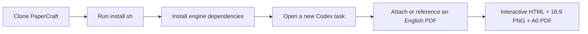

# 🧪 PaperCraft Poster for Codex

> Turn an English research PDF into an evidence-grounded interactive poster,
> Screen 16:9 graphic, and print-ready A0 PDF — using your Codex account rather
> than a model API key.

[](./.codex-plugin/plugin.json)

## ✨ What you get

- Grounded paper extraction, semantic analysis, narrative planning, visual
  direction, export, and review via the local PaperCraft engine.
- Interactive HTML, a Screen 16:9 PNG, an A0 PDF, and a print preview.
- No `OPENAI_API_KEY` or other model API key: semantic stages use the locally
  authenticated Codex account.

## 🚀 One-command install

> ⚠️ **Prerequisite:** clone the complete PaperCraft repository. This plugin calls
> the checked-in engine; installing the plugin folder alone is not sufficient.

```bash
git clone <YOUR-PAPERCRAFT-REPOSITORY-URL> PaperCraft && \
cd PaperCraft && \
bash .agents/plugins/papercraft-poster/install.sh
```

```text
# Start a new Codex task in the PaperCraft repository, then say:
Use $papercraft-poster to turn /absolute/path/to/paper.pdf into a reviewed poster.
```



## 🛠️ Prepare the engine once

From the repository root:

```bash
cd papercraft
python3 -m venv .venv
.venv/bin/pip install -e '.[test]'
npm install --prefix web
```

Verify the local requirements and your Codex login before running a large batch:

```bash
python3 ../.agents/plugins/papercraft-poster/scripts/check_environment.py --auth-probe
```

The check makes one small Codex request. A successful result has `"ready": true`.

## 🎨 Use it

Start a **new** Codex task in this repository and use either prompt:

```text
Use $papercraft-poster to turn papers/my-paper.pdf into a reviewed poster.
```

```text
Use $papercraft-poster to create an interactive poster, a Screen 16:9 PNG, and an A0 PDF from this attached research paper.
```

## 🔄 Updating the plugin

After pulling a new version of the repository, refresh the installed plugin:

```bash
python3 ~/.codex/skills/.system/plugin-creator/scripts/update_plugin_cachebuster.py \
  "$(pwd)/.agents/plugins/papercraft-poster"
bash .agents/plugins/papercraft-poster/install.sh
```

Start a new Codex task after reinstalling so it picks up the revised skill.

## 🧯 Troubleshooting

| Symptom | What to do |
| --- | --- |
| `PaperCraft CLI not found` | Complete **Prepare the engine once** from the same repository clone. |
| `Codex CLI is required` | The installer now finds the macOS app automatically. If it still fails, run `CODEX_BIN=/Applications/ChatGPT.app/Contents/Resources/codex bash .agents/plugins/papercraft-poster/install.sh`. |
| Plugin is not listed | Run `bash .agents/plugins/papercraft-poster/install.sh` from the cloned repository, then reopen Codex. |
| Codex authentication fails | Sign in to Codex again, then rerun the environment check. |
| Plugin installed outside the repo | Set `PAPERCRAFT_PROJECT_ROOT` to the absolute PaperCraft repository path before running helper scripts. |

## 📦 Package contents

```text
.agents/plugins/
├── marketplace.json
└── papercraft-poster/
    ├── .codex-plugin/plugin.json
    ├── skills/papercraft-poster/
    ├── scripts/
    └── README.md
```

The plugin includes the reusable Codex workflow and helper scripts. The
PaperCraft engine remains in `papercraft/` so source, renderer, and plugin stay
versioned together.
