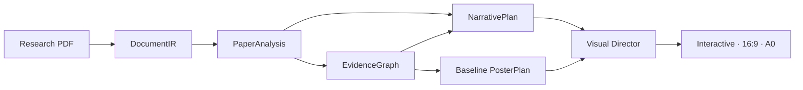

# PaperCraft

> Compile an English research paper into a source-grounded scientific story,
> then render it as an interactive poster, a Screen 16:9 graphic, and an A0
> print poster.

[](plugins/papercraft-poster/README.md)
[](papercraft/README.md)

PaperCraft is not simply PDF → poster. It treats a paper as a scientific
argument, compiles that argument into a canonical NarrativePlan, then applies a
constrained Visual Director and deterministic renderer. This keeps claims,
evidence, limitations, and their original source locations traceable through
every output.

## What it produces

- an offline interactive HTML poster with source inspection;
- a polished 1920×1080 Screen 16:9 PNG;
- a one-page print-ready A0 landscape PDF and preview;
- versioned semantic artifacts: `DocumentIR`, `PaperAnalysis`,
  `EvidenceGraph`, `NarrativePlan`, `VisualPlan`, and `PosterPlan`.



The Visual Director selects a narrative archetype—such as method pipeline,
causal intervention, or mechanism explainer—while preserving renderer-safe
component constraints and layout validation.

## Quick start with Codex

The recommended path uses the Codex account already signed in on your machine;
no model-provider API key is required for the normal semantic workflow.

```bash
git clone https://github.com/wenruihuang1/PaperCraft.git
cd PaperCraft

cd papercraft
python3 -m venv .venv
.venv/bin/pip install -e '.[test]'
npm install --prefix web
cd ..

bash plugins/papercraft-poster/install.sh
```

Open a new Codex task in this repository and write:

```text
Use $papercraft-poster to turn /absolute/path/to/paper.pdf into a reviewed poster.
```

The input must be an English, text-based PDF. Scanned PDFs and unsupported
languages are rejected explicitly rather than silently OCR'd.

Verify the local engine and Codex sign-in before a longer run:

```bash
python3 plugins/papercraft-poster/scripts/check_environment.py --auth-probe
```

After pulling a plugin update, reinstall it and start a new Codex task so the
new workflow is loaded:

```bash
bash plugins/papercraft-poster/install.sh
```

For macOS CLI paths, terminal commands, repair steps, and troubleshooting, use
the [plugin README](plugins/papercraft-poster/README.md).

## Repository map

| Directory | Purpose |
| --- | --- |
| [papercraft/](papercraft/) | Core engine: ingestion, semantic artifacts, planner, renderer, review, API, and web studio. |
| [plugins/](plugins/) | Installable Codex plugin and reusable paper-to-poster workflow. |
| [docs/](docs/) | Project-level guides and links to the technical documentation. |
| [examples/](examples/) | Prompts, expected artifacts, and practical run patterns. |

## Two READMEs, intentionally

- This root README is the **project homepage**: what PaperCraft is, how to run
  it, and where the main pieces live.
- [papercraft/README.md](papercraft/README.md) is the **engine README**: full
  local setup, API/model-provider options, test commands, contracts, and
  technical boundaries.

They are complementary rather than competing. Keep installation and usage
instructions at the root; keep implementation detail beside the engine.

## Learn more

- [Architecture and artifact flow](papercraft/docs/architecture.md)
- [Evaluation protocol and gold papers](papercraft/evaluation/README.md)
- [Narrative Planner v1 audit](papercraft/evaluation/narrative_planner.v1.audit.json)
- [Codex plugin setup and troubleshooting](plugins/papercraft-poster/README.md)
- [Project documentation map](docs/README.md)

## Current scope

PaperCraft is a local research prototype with reviewed gold papers and a
deterministic rendering path. It currently targets English text PDFs and poster
outputs; OCR, scanned documents, LaTex source ingestion, PPTX export, and a
large-scale external benchmark are intentionally out of scope for now.
