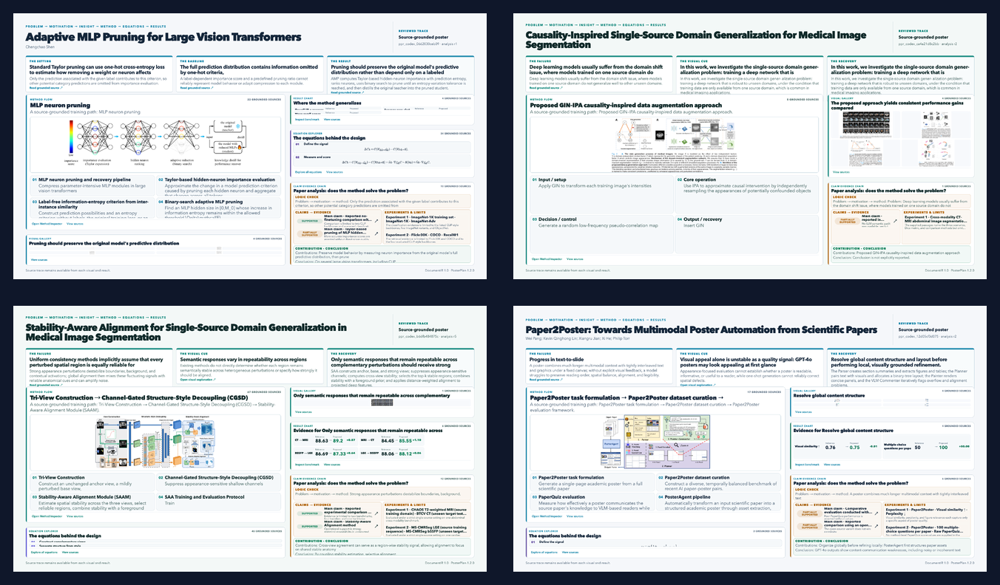

# PaperCraft 四篇论文产物汇总

本目录集中保存四篇论文的完整 PaperCraft 输出。每篇论文目录都保留了同一套可交付文件：

- `interactive/index.html`：可交互海报（可直接用浏览器打开）
- `screen-16x9.png`：16:9 屏幕版
- `screen-narrow.png`：窄屏版
- `print-a0-preview.png`：A0 打印预览
- `method-inspector.png`、`source-inspector.png`、`equation-inspector.png`：检查视图（若该版本生成）
- `render_metrics.json`：渲染指标
- `source.pdf`：对应论文源文件

## 总览

## 论文与产物

| 序号 | 论文 | 交互式 HTML | 16:9 | 窄屏 | A0 预览 |
| --- | --- | --- | --- | --- | --- |
| 01 | Adaptive MLP Pruning for Large Vision Transformers | [打开 HTML](01-adaptive-mlp-pruning/interactive/index.html) | [PNG](01-adaptive-mlp-pruning/screen-16x9.png) | [PNG](01-adaptive-mlp-pruning/screen-narrow.png) | [PNG](01-adaptive-mlp-pruning/print-a0-preview.png) |
| 02 | Causality-Inspired Single-Source Domain Generalization for Medical Image Segmentation | [打开 HTML](02-causality-inspired-ssdg/interactive/index.html) | [PNG](02-causality-inspired-ssdg/screen-16x9.png) | [PNG](02-causality-inspired-ssdg/screen-narrow.png) | [PNG](02-causality-inspired-ssdg/print-a0-preview.png) |
| 03 | Stability-Aware Alignment for Single-Source Domain Generalization in Medical Image Segmentation | [打开 HTML](03-stability-aware-alignment/interactive/index.html) | [PNG](03-stability-aware-alignment/screen-16x9.png) | [PNG](03-stability-aware-alignment/screen-narrow.png) | [PNG](03-stability-aware-alignment/print-a0-preview.png) |
| 04 | Paper2Poster: Towards Multimodal Poster Automation from Scientific Papers | [打开 HTML](04-paper2poster/interactive/index.html) | [PNG](04-paper2poster/screen-16x9.png) | [PNG](04-paper2poster/screen-narrow.png) | [PNG](04-paper2poster/print-a0-preview.png) |

## 说明

这些文件来自仓库中四个最新的 Codex 产物 job：

- `codex_0662030ceb09`
- `codex_ca4a21d8c2bb`
- `codex_b66fb484875c`
- `codex_12d05cf3d075`

交互式 HTML 使用相对路径加载同目录下的 `assets/` 和 `source/`，因此请保持每篇论文目录的完整结构，不要只单独下载 `index.html`。
