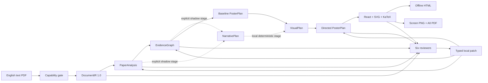

# Architecture and data flow

## Pipeline

The optional Narrative Planner compiles the validated semantic artifacts into a
source-grounded argument graph and one 5–9-node primary path. It receives the
PaperAnalysis and EvidenceGraph JSON plus only their cited source excerpts; it
does not receive the full DocumentIR.

The optional Visual Director consumes NarrativePlan plus an already-valid
PosterPlan. It is deliberately local and deterministic: it selects a visual
grammar, changes dynamic narrative wording, and assigns the existing components
to the existing ordered grid slots. It cannot create components, colors,
coordinates, or layout geometry. Both Screen and Print slot geometry must be
identical to the baseline, and a deterministic review error saves a `fallback`
VisualPlan while retaining the baseline PosterPlan.

## Public artifacts

| Artifact | Purpose | Upstream revision |
|---|---|---|
| `document_ir.json` | Stable PDF geometry and source-addressable content | PDF hash |
| `paper_analysis.json` | Problem, Motivation, Insight, Method, Equation, Claim, Experiment, Conclusion | DocumentIR |
| `evidence_graph.json` | Claim evidence, edges, three-state assessment, six sufficiency dimensions | PaperAnalysis |
| `narrative_plan.json` *(optional)* | Canonical narrative archetype, argument graph, primary path, claim coverage, and boundaries | Analysis + Evidence |
| `visual_plan.json` *(optional)* | Renderer-safe visual archetype, existing-component order, and narrative hero nodes; no geometry | Narrative + baseline PosterPlan |
| `poster_plan.json` | Controlled components, interactions, theme, independent Screen/Print layouts | Analysis + Evidence |
| `review_result.json` | Six structured checks and executable local repairs | All four + renders |

All public artifacts contain `paper_id`, `schema_version`,
`artifact_revision`, and explicit upstream revisions. New revisions are written
as new files under `runtime/jobs/<job>/artifacts`; they are not silently
overwritten.

## Runtime modules

- `ingest/`: independent PDF adapter and PyMuPDF implementation;
- `analysis/`: source packet construction, heuristic baseline, and three-pass
  semantic analyzer;
- `evidence/`: structured Claim–Evidence construction;
- `planning/`: one-call semantic Narrative Planner, deterministic Visual
  Director, and deterministic poster components with two layout profiles;
- `render/`: production Web build, offline bundle, browser measurement, PDF,
  and PDF-derived preview;
- `review/`: deterministic six-checker review, Claude semantic audit, typed
  OpenAI repair, and PosterPlan local repair;
- `providers/`: provider-neutral protocol plus Anthropic API, OpenAI Responses,
  and local account-authenticated Codex CLI structured adapters;
- `.agents/skills/papercraft-poster/`: repository-scoped Codex workflow plus
  environment and end-to-end runners; the Codex adapter uses account-authenticated
  `codex exec` structured outputs and never inherits model API keys;
- `runtime/`: conservative cost reservation and hard budget ledger;
- `storage/`: SQLite job history and immutable artifact revisions;
- `api.py` / `web/`: local FastAPI and React application.

## Review loops

Semantic review is bounded: Claude audits content, evidence, and formula
accuracy; OpenAI may replace only named typed objects; Claude rechecks; at most
two repairs are allowed. Untouched semantic-object hashes must not change.

Layout review is also bounded: the browser measures both profiles, creates
structured issues, and applies only local PosterPlan operations. Layout bounds
and rectangle collision validation prevent a repair from damaging neighboring
components. At most three layout repairs are allowed; unresolved output remains
`review_failed`.

## Offline package

Vite emits relative assets. `poster_data.js` embeds only validated JSON, while
source image crops and KaTeX fonts are copied into the package. The static
directory can be opened without FastAPI or a network connection.
