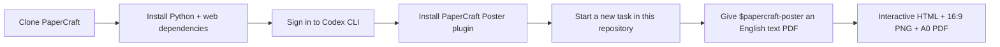

# 🧪 PaperCraft Poster for Codex

> Turn an English, text-based research PDF into an evidence-grounded interactive
> poster, a Screen 16:9 image, and a print-ready A0 PDF — using the Codex
> account already signed in on your computer, rather than a model API key.

[](./.codex-plugin/plugin.json)

## What this plugin needs

PaperCraft runs locally. The plugin provides the reusable Codex workflow, while
the checked-in `papercraft/` directory provides extraction, planning, rendering,
review, and repair. Installing only this plugin folder is not enough.

| Requirement | Why it is needed | Check |
| --- | --- | --- |
| PaperCraft repository | Contains the local engine and renderer | `test -d papercraft` |
| Codex CLI and a signed-in Codex account | Runs the semantic analysis and narrative stages | `codex --version` |
| Python 3.11+ | Runs PaperCraft | `python3 --version` |
| Node.js and npm | Builds and renders the web poster | `node --version && npm --version` |
| An English, text-based PDF | PaperCraft intentionally does not OCR scanned PDFs | Use an absolute PDF path |

No `OPENAI_API_KEY`, `ANTHROPIC_API_KEY`, or other model-provider API key is
required for the normal Codex path. PaperCraft removes those variables from its
Codex child process so semantic work uses the locally authenticated Codex CLI.

## Quick start

Run these commands in a terminal. Replace the repository URL and PDF path with
your own values.

```bash
git clone <YOUR-PAPERCRAFT-REPOSITORY-URL> PaperCraft
cd PaperCraft

# Create the local engine environment (one time per checkout).
cd papercraft
python3 -m venv .venv
.venv/bin/pip install -e '.[test]'
npm install --prefix web
cd ..

# Install the PaperCraft Poster plugin into the current Codex profile.
bash plugins/papercraft-poster/install.sh
```

Then open a **new Codex task** with `/absolute/path/to/PaperCraft` as the
workspace and send one of these prompts:

```text
Use $papercraft-poster to turn /absolute/path/to/paper.pdf into a reviewed poster.
```

```text
Use $papercraft-poster to create an interactive poster, a Screen 16:9 PNG, and an A0 PDF from this attached research paper.
```



## Set up Codex CLI on macOS

The installer needs a local `codex` executable. If `codex --version` works,
you are ready. The Codex desktop app typically bundles the CLI at one of these
paths:

```bash
/Applications/ChatGPT.app/Contents/Resources/codex --version
/Applications/Codex.app/Contents/Resources/codex --version
```

If the command is not on your shell `PATH`, the installer can still use it
directly:

```bash
cd /absolute/path/to/PaperCraft
CODEX_BIN=/Applications/ChatGPT.app/Contents/Resources/codex \
  bash plugins/papercraft-poster/install.sh
```

For the second app location, substitute:

```bash
CODEX_BIN=/Applications/Codex.app/Contents/Resources/codex \
  bash plugins/papercraft-poster/install.sh
```

Sign in to Codex before an authenticated run. If your installed CLI supports
the command, use:

```bash
codex login
```

Otherwise, sign in through the Codex desktop app and then confirm the account
works with the environment check below. The check looks for the saved local
auth state; `--auth-probe` also performs one small Codex request.

## Verify the installation

From the repository root:

```bash
python3 plugins/papercraft-poster/scripts/check_environment.py
python3 plugins/papercraft-poster/scripts/check_environment.py --auth-probe
```

The second command needs a successful Codex login and makes one small remote
request. A ready-to-run installation ends with JSON containing:

```json
{
  "ready": true
}
```

If `codex` works only through an app path, make it available to the current
terminal before the check:

```bash
export PATH="/Applications/ChatGPT.app/Contents/Resources:$PATH"
python3 plugins/papercraft-poster/scripts/check_environment.py --auth-probe
```

## Run from the terminal

The Codex task experience is the recommended entry point because the skill
inspects the output visually. You can also run the complete local pipeline
yourself:

```bash
cd /absolute/path/to/PaperCraft/papercraft
.venv/bin/papercraft codex-run /absolute/path/to/paper.pdf
```

The command prints the job ID plus output paths for:

- interactive HTML;
- Screen 16:9 PNG;
- print-preview PNG;
- A0 PDF.

Optional stable identifiers make repeated runs easier to find:

```bash
.venv/bin/papercraft codex-run /absolute/path/to/paper.pdf \
  --paper-id my_paper \
  --job-id my_paper_v1
```

## Resume or repair a job

Do not restart from the PDF unless ingestion failed. Keep already validated
revisions, then continue from the failed stage. Run these from `papercraft/`:

```bash
# Semantic analysis failed or needs a new Codex attempt.
.venv/bin/papercraft codex-analyze <job_id>

# Narrative planning failed after a successful analysis.
.venv/bin/papercraft codex-narrate <job_id>

# Rebuild the baseline layout with the current engine.
.venv/bin/papercraft plan <job_id>

# Reapply constrained visual direction.
.venv/bin/papercraft direct <job_id>

# Re-render the interactive and print artifacts.
.venv/bin/papercraft export <job_id>
```

If a hard Codex account quota prevents semantic work but a provisional result
is necessary, use the explicit extractive fallback, then plan and export:

```bash
.venv/bin/papercraft offline-analyze <job_id>
.venv/bin/papercraft plan <job_id>
.venv/bin/papercraft export <job_id>
```

This fallback is **not** a Codex semantic review and should be labelled as an
extractive offline poster when shared.

## Plugin commands

Install and refresh the plugin from the PaperCraft repository root:

```bash
# First install, or reinstall after a local plugin change.
bash plugins/papercraft-poster/install.sh

# After pulling a newer plugin version, refresh the installed cache key first.
python3 ~/.codex/skills/.system/plugin-creator/scripts/update_plugin_cachebuster.py \
  "$(pwd)/plugins/papercraft-poster"
bash plugins/papercraft-poster/install.sh
```

Start a new Codex task after installing or updating so the new skill is loaded.

## Troubleshooting

| Symptom | Cause | What to do |
| --- | --- | --- |
| `Codex CLI is required` | The installer cannot find the CLI. | Check the app-bundled paths above, or pass `CODEX_BIN=/absolute/path/to/codex` to `install.sh`. |
| `codex: command not found` | The app-bundled CLI is not on `PATH`. | Use `CODEX_BIN` for installation; add its directory to `PATH` before running the environment probe or terminal pipeline. |
| `PaperCraft CLI not found` | The Python environment was not prepared in this checkout. | Run the commands in **Quick start** beginning with `cd papercraft`. |
| `"ready": false` | One or more local requirements are unavailable. | Read the other fields in the JSON; they identify the missing engine, CLI, Node/npm, or auth probe. |
| Codex authentication fails | The local Codex account is not signed in or the session has expired. | Sign in again through `codex login` or the Codex app, then rerun `--auth-probe`. |
| Plugin does not appear in the picker | Codex has not reloaded the installation. | Run the installer from the repository root and open a new Codex task. |
| Plugin is installed from another checkout | The helper cannot infer the engine location. | Set `PAPERCRAFT_PROJECT_ROOT=/absolute/path/to/PaperCraft` before running helper scripts. |
| PDF is rejected | It is scanned, non-English, or lacks extractable text. | Supply an English text-based PDF; PaperCraft does not silently OCR unsupported inputs. |

## Package contents

```text
.agents/plugins/marketplace.json
plugins/papercraft-poster/
├── .codex-plugin/plugin.json      # Plugin manifest and picker metadata
├── skills/papercraft-poster/      # The reusable Codex workflow
├── scripts/check_environment.py   # Local dependency and auth verification
├── install.sh                     # Marketplace registration + installation
└── README.md
```

The plugin is deliberately separate from the engine: the plugin makes the
workflow reusable in Codex, while `papercraft/` stays versioned alongside the
source, renderer, and generated runtime data.
